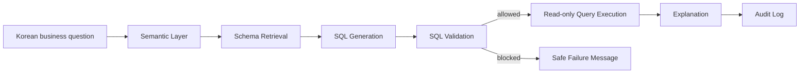

# Demo Script

## 1. Opening

"이번 POC는 증권사 현업에서 반복되는 데이터 조회 병목을 줄이는 내부 업무형 NL2SQL 에이전트입니다. 핵심은 SQL 생성 자체가 아니라, 증권사 환경에서 쓸 수 있도록 검증, 설명, 감사 로그까지 포함한 안전한 조회 흐름을 만드는 것입니다."

## 2. Pain point

- 현업자는 질문을 한국어로 알고 있습니다.
- 데이터는 테이블/컬럼/집계 기준으로 흩어져 있습니다.
- 단순 확인도 데이터 담당자에게 요청해야 합니다.
- SQL 오류나 권한 없는 조회는 운영 리스크가 됩니다.

## 3. Architecture



## 4. Live demo commands

```bash
python -m im_one_agent.cli --demo
```

Single question:

```bash
python -m im_one_agent.cli --question "이번 달 고위험 상품 가입 건수가 많은 지점은?"
```

## 5. What to emphasize

- Schema Retrieval로 질문과 관련된 스키마만 컨텍스트에 넣습니다.
- SQL Validation이 실행 전 위험 쿼리를 차단합니다.
- 결과만 주지 않고 기준, 테이블, 집계 단위를 설명합니다.
- 누가 어떤 질문으로 어떤 SQL을 실행했는지 감사 로그에 남깁니다.

## 6. Closing

"금요일 POC는 가상 데이터 기반이지만, 실제 확장 시에는 내부망 LLM, 읽기 전용 DB, 권한 정책, 감사 로그를 결합해 증권사 내부 업무형 데이터 에이전트로 발전시킬 수 있습니다."
