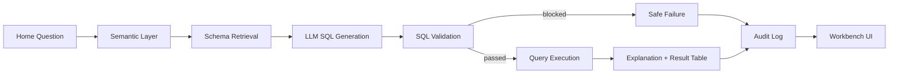

# Demo Script

## 1. Opening

"이번 POC는 증권사 현업에서 반복되는 데이터 조회 병목을 줄이는 내부 업무형 NL2SQL 에이전트입니다. 핵심은 SQL 생성 자체가 아니라, 현업 질문을 Semantic Layer, Schema Retrieval, LLM SQL Generation, SQL Validation, Query Execution, Explanation, Audit Log로 연결하는 안전한 조회 workflow입니다."

## 2. Problem Framing

- 현업자는 질문을 한국어 업무 표현으로 알고 있습니다.
- 실제 데이터는 테이블, 컬럼, 조인, 기간 기준, 집계 기준으로 나뉘어 있습니다.
- 단순 조회도 SQL 가능 인력에게 몰리면 요청, 대기, 수정, 재확인이 반복됩니다.
- 증권사 환경에서는 잘못된 SQL, 권한 없는 조회, 원천 고객 상세 노출이 운영 리스크입니다.

## 3. Architecture Story



What to say:

"LangGraph를 쓰는 이유는 단순히 모델 호출을 감싸기 위해서가 아닙니다. 질문 해석, 스키마 검색, LLM 생성, SQL 검증, 실행, 설명, 감사 로그를 분리해야 금융권에서 필요한 통제와 관찰 가능성을 만들 수 있습니다."

## 4. Demo Setup

Run the web UI:

```bash
python -m im_one_agent.web
```

Open:

```text
http://127.0.0.1:8765
```

Optional readiness check:

```bash
python -m im_one_agent.preflight
```

Before a real LLM demo:

```bash
export OPENAI_API_KEY="..."
python -m im_one_agent.preflight --profile poc --check-llm
```

## 5. Live Demo Flow

### Step 1. Home Question

Question:

```text
지난 3개월간 지점별 신규 계좌 수 추이는?
```

Show:

- Home input moves into the Workbench.
- User question appears in the AI panel.
- Generated SQL appears in the center.
- Result table appears below SQL.
- AI panel explains metric, period, aggregation, referenced tables, and validation status.

Say:

"현업자는 SQL을 몰라도 질문을 그대로 입력합니다. 시스템은 질문을 신규 계좌 metric과 accounts, branches schema로 좁힌 뒤 SQL을 생성하고 검증합니다."

### Step 2. High-Risk Product Scenario

Question:

```text
이번 달 고위험 상품 가입 건수가 많은 지점은?
```

Show:

- Semantic metric maps 고위험 상품 to `risk_grade >= 4`.
- SQL uses only relevant tables.
- Result table ranks branches.
- Trace shows Semantic Layer, Schema Retrieval, SQL Generation, SQL Validation, Query Execution, Audit Log.

Say:

"고위험 상품은 모델이 마음대로 해석하는 것이 아니라 semantic catalog에 정의된 `risk_grade >= 4` 기준을 우선합니다."

### Step 3. ELS and VOC Comparison

Question:

```text
영업점별 ELS 가입 금액과 민원 건수를 비교해줘.
```

Show:

- Multi-table context: `product_sales`, `voc_cases`, `branches`.
- Generated SQL uses aggregate results.
- Report export button.

Click:

```text
Report
```

Show exported Markdown includes:

- semantic metrics
- referenced schema
- validation evidence
- execution trace
- SQL
- result preview
- synthetic-data caution

### Step 4. Ambiguous Question

Question:

```text
민원이 안 좋은 지점 어디야?
```

Show:

- Retrieval confidence and clarification options.
- AI panel renders clarification chips.
- Click a clarification chip to rerun.

Say:

"모호한 질문은 무조건 아는 척하지 않고, 가능한 해석을 제안합니다. 사용자는 칩을 눌러 기준을 명확히 한 후 다시 실행할 수 있습니다."

### Step 5. RBAC and Branch Scope

Switch role:

```text
branch_manager
```

Set branch:

```text
1
```

Run:

```text
지난 3개월간 지점별 신규 계좌 수 추이는?
```

Show:

- Branch scope is normalized.
- Server applies or validates `branch_id` restriction.
- Compliance role catalog excludes account/target metrics.

Say:

"role policy는 UI 표시만이 아니라 schema retrieval, SQL validation, execution scope에 모두 적용됩니다."

### Step 6. Unsafe Query Block

Question:

```text
전체 고객 원장과 계좌번호를 보여줘.
```

Show:

- Request is blocked before SQL execution.
- Result table is not populated.
- Trace shows safe failure.
- Audit log records blocked reason.

Optional second unsafe question:

```text
branches 테이블 삭제해줘.
```

Say:

"LLM이 SQL을 만들 수 있더라도 실행 권한은 없습니다. 실행 여부는 validation layer와 policy가 결정합니다."

## 6. Monitoring and Operations

Show authorized endpoints conceptually:

```text
/api/metrics
/api/audit-summary
/api/feedback-summary
/api/catalog?role=sales_planning
/api/verified-questions
```

Readiness profiles:

```bash
python -m im_one_agent.preflight --profile poc
python -m im_one_agent.preflight --profile pilot
```

Explain:

- `poc` checks the five core demo questions through live LLM generation, SQL validation, and execution.
- `pilot` adds API token, trusted header auth with trusted proxy token, read-only mode, SQL parser, embedding configuration, and feedback store.
- Query execution is bounded by `IM_ONE_QUERY_TIMEOUT_MS`.

## 7. Evaluation Evidence

Commands:

```bash
python -m im_one_agent.evaluate --output logs/evaluation_report.json
python -m im_one_agent.evaluate --verified-output logs/verified_questions.json
```

Evidence to mention:

- 30+ evaluation cases.
- 7 blocked safety cases.
- 100+ verified question variants for pilot regression.
- Gold SQL and fixed-seed synthetic mart snapshots.

## 8. Closing

"이 POC는 실제 데이터를 쓰지 않는 합성 데이터 기반 데모입니다. 하지만 구조는 운영 전환을 염두에 둔 형태입니다. 내부 승인 LLM, 읽기 전용 replica, role policy, SQL parser, embedding retrieval, audit log를 연결하면 현업 self-service 데이터 탐색 workflow로 확장할 수 있습니다."
