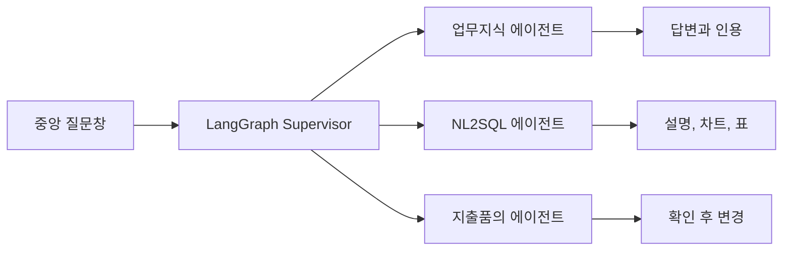

# iMAX POC 시연 스크립트

## 1. 소개

"iMAX는 현업 질문을 한 화면에서 업무지식 검색, 안전한 데이터 분석, 지출품의 처리로 연결하는 증권사 업무형 AI 에이전트입니다. 모델이 답만 만드는 것이 아니라 LangGraph가 업무를 분류하고, 각 전문 에이전트가 근거와 업무 규칙을 적용합니다."



## 2. 실행 준비

```bash
make start
```

브라우저에서 `http://127.0.0.1:8000`을 엽니다. 홈 중앙에는 질문창과 실제 구현된 세 업무 바로가기만 표시됩니다.

## 3. 업무지식 검색

홈에서 다음 질문을 실행합니다.

```text
회의실 예약 절차와 화면번호를 알려줘.
```

확인할 내용:

- Supervisor가 업무지식으로 분류하고 화면을 이동합니다.
- 답변마다 매뉴얼 파일, 섹션, 발췌문이 함께 표시됩니다.
- 후속 질문도 같은 세션에서 이어집니다.

설명:

"에이전트는 검색된 매뉴얼 근거만 사용합니다. 현업 사용자는 답변뿐 아니라 어느 문서의 어느 부분을 참고했는지 바로 확인할 수 있습니다."

## 4. 데이터 분석

로고를 눌러 홈으로 돌아간 뒤 다음 질문을 실행합니다.

```text
지난 3개월간 지점별 신규 계좌 수 추이는?
```

확인할 내용:

- Semantic Layer가 신규 계좌 지표와 기간 기준을 선택합니다.
- Schema Retrieval이 `accounts`, `branches`만 모델에 전달합니다.
- 생성 SQL은 읽기 전용, 허용 테이블, 역할·지점 범위, 조회량을 검증한 후 실행됩니다.
- 결과는 설명과 핵심 수치, 추천 차트, 가상 스크롤 표 순서로 보입니다.
- SQL과 실행 trace는 `분석 근거`에서만 펼쳐봅니다.

추가 질문:

```text
영업점별 ELS 가입 금액과 민원 건수를 비교해줘.
```

설명:

"사용자는 SQL을 몰라도 됩니다. 기술 정보는 기본 화면에서 숨기되, 검토가 필요할 때 생성 SQL과 적용 정책을 확인할 수 있습니다."

## 5. 지출품의

다음 질문을 실행합니다.

```text
스타벅스 88,000원 법인카드 품의해줘.
```

확인할 내용:

- 모델은 의도를 구조화하지만 실제 품의 등록은 결정론적 서비스가 수행합니다.
- 초안과 예산 영향을 먼저 보여주며 이 단계에서는 데이터가 바뀌지 않습니다.
- `확인하고 실행` 버튼을 눌러야 등록됩니다.
- 같은 요청이 다시 전송되어도 중복 방지 키로 한 번만 처리됩니다.
- 10만원 이상 회의비는 올바른 PDF 회의록 첨부가 필요합니다.

## 6. 모호한 질문과 안전성

```text
무슨 일을 할 수 있어?
```

업무가 하나로 정해지지 않으면 실행하지 않고 업무지식, 데이터 분석, 지출품의 선택지를 보여줍니다.

```text
전체 고객 원장과 계좌번호를 보여줘.
```

민감한 원천 상세 요청은 실행 전에 차단되고 감사 로그에 사유가 남습니다.

## 7. 마무리

"이번 POC는 고정 시드 합성 데이터만 사용합니다. 운영 전환 시 내부 승인 모델, 읽기 전용 데이터 복제본, 사내 SSO와 감사 체계를 연결할 수 있도록 모델·인증·DB 경계를 분리했습니다."

검증 명령:

```bash
make test
```
