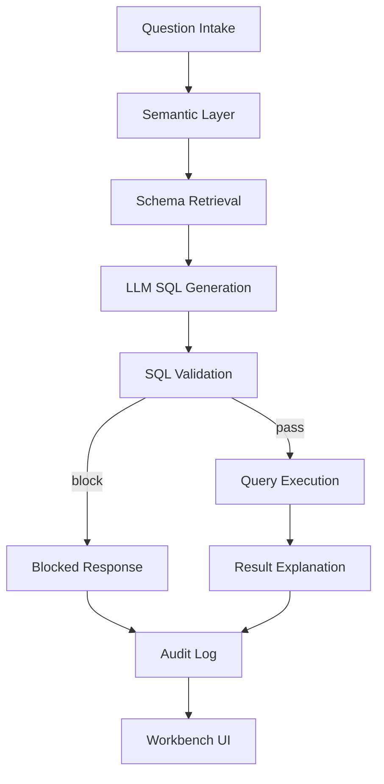

# iM One NL2SQL Agent PRD

문서 상태: Draft v1  
작성일: 2026-07-09  
대상 일정: AI Agent Bootcamp POC, 2026-07-10 금요일 데모  
대상 제품: iM One NL2SQL Agent  
작성 목적: 증권사 현업 데이터 탐색 업무를 LLM 기반 NL2SQL 에이전트로 개선하기 위한 제품 요구사항 정의

## 1. 요약

iM One NL2SQL Agent는 증권사 현업 담당자가 한국어로 묻는 반복 데이터 질문을 안전한 SQL 조회, 결과 테이블, 해석 설명, 실행 추적 로그까지 연결하는 내부 업무형 AI 에이전트다.

핵심 문제는 "데이터가 없는 것"이 아니라 "필요한 사람이 필요한 순간에 바로 꺼내 쓰기 어렵다"는 점이다. 계좌 개설 추이, 고위험 상품 판매 현황, VOC 처리 상태, 투자성향 점검 미완료 현황 같은 질문은 자주 반복되지만, 실제 답을 얻으려면 데이터 구조 이해, SQL 작성, 기준 확인, 결과 검증이 필요하다. 이 과정이 특정 SQL 가능 인력에게 집중되면 단순 조회도 요청-대기-수정-재확인의 병목을 만든다.

본 POC는 BigShift의 온프레미스 NL2SQL 사례에서 영감을 받는다. 단순히 "질문을 SQL로 바꾸는 모델"이 아니라, 업무 용어 사전, 관련 스키마 검색, LLM SQL 생성, SQL 검증, 실행, 설명, 권한/감사 로그가 이어지는 검증 가능한 워크플로를 목표로 한다.

POC의 생성엔진은 LLM이어야 한다. 제품 가치와 심사 포인트는 LLM이 업무 맥락과 스키마 컨텍스트를 받아 SQL을 생성하고, LangGraph 워크플로가 이를 안전하게 검증하고 실행하는 구조에 있다.

## 2. 배경과 리서치

### 2.1 사용자 제공 BigShift 사례에서 가져온 핵심 교훈

사용자가 공유한 BigShift 사례는 관광 관련 공공기관이 축적한 공공데이터를 온프레미스 NL2SQL로 탐색 가능하게 만든 프로젝트다. 해당 사례의 핵심은 다음과 같다.

- 성과 지표: 데이터 질의 작성 시간 약 80% 단축, 비정형 리서치 요청 대응 속도 5배 향상.
- 문제 정의: 데이터는 충분히 축적되어 있으나, DB 구조와 SQL을 이해하는 담당자에게 조회 요청이 집중됨.
- 주요 난점: 기간 기준, 지역 코드, 시설 분류, 사업 단위, 예산 항목, 집계 기준이 질문마다 얽혀 단순 텍스트 변환형 NL2SQL로는 신뢰 확보가 어려움.
- 보안 제약: 외부 SaaS로 데이터 반출 불가, 운영 DB에 위험한 쿼리 실행 불가.
- 해결 구조: Semantic Layer, Schema Retrieval, SQL Validation Layer, Query Explanation Layer, 권한 통제 및 감사 로그.
- 제품 관점의 핵심: 복잡한 DB 구조를 숨기는 것이 아니라, 현업자의 질문을 안전하고 검증 가능한 조회 흐름으로 다시 연결하는 것.

iM One의 방향도 같다. 증권사 업무에서도 "신규 계좌", "고위험 상품", "ELS 가입 금액", "VOC", "투자성향 점검" 같은 현업 언어가 실제 테이블, 컬럼, 조인, 집계 기준과 분리되어 있다. 따라서 POC는 LLM 답변 챗봇이 아니라, 안전한 데이터 조회 워크플로를 보여줘야 한다.

### 2.2 시장 및 기술 리서치

Snowflake Cortex Analyst는 구조화 데이터에 대해 자연어 질문을 SQL과 답변으로 연결하는 LLM 기반 기능이다. 특히 semantic model 또는 semantic view를 통해 business concept, metric, relationship, verified example을 정의하는 점이 중요하다. Snowflake 문서도 스키마만으로는 업무 정의와 지표 처리 지식이 부족하므로 semantic model이 정확도를 높인다고 설명한다.

Databricks Genie Agents는 도메인 특화 자연어 데이터 채팅 인터페이스다. 데이터 분석가가 Unity Catalog dataset, example SQL, business semantics, 조직 용어에 맞춘 instruction을 curate해야 한다는 점이 iM One PRD와 직접 연결된다. 즉 "LLM만 붙이면 된다"가 아니라, 분석가가 신뢰 가능한 데이터 자산과 예시 SQL을 지속적으로 관리해야 한다.

LangGraph의 SQL agent 패턴은 listing tables, getting schema, generating query, checking query를 별도 node로 구성할 것을 권장한다. 이 구조는 본 POC가 LangGraph를 쓰는 이유와 맞다. SQL 생성, 검증, 실행, 설명을 한 프롬프트 안에 몰아넣는 방식보다, 각 단계를 노드로 분리해야 안전 장치와 관찰 가능성을 만들 수 있다.

최근 NL2SQL 연구도 같은 방향을 가리킨다. 기업 DB는 수백 개 테이블, 난해한 컬럼명, 복잡한 조인, 시계열/집계 요구 때문에 raw schema 기반 text-to-SQL만으로 정확도가 낮다. Semantic-layer-mediated 접근은 업무 의미와 물리 SQL 실행을 분리해 grounding을 강화한다. ODIN 연구는 엔터프라이즈 환경에서 유사한 테이블/컬럼이 많아 schema ambiguity가 핵심 문제라고 설명하며, 모호한 경우 여러 해석 후보와 사용자 피드백이 필요하다고 제안한다. AgentNLQ 연구는 schema enrichment, business rules, planning/reflection/self-correction을 통해 NL2SQL 정확도를 높이는 multi-agent 접근을 제시한다.

합성 금융 데이터 리서치도 중요한 시사점을 준다. 금융 도메인은 규제 위험과 class imbalance가 큰 영역이므로 합성 데이터를 쓰더라도 privacy-utility tradeoff를 평가해야 한다. POC는 실제 고객/계좌/직원/민감 정보를 절대 저장하지 않고, 통계 패턴만 가진 완전 가상 데이터로 출발해야 한다.

### 2.3 참고 자료

- Snowflake Cortex Analyst: https://docs.snowflake.com/en/user-guide/snowflake-cortex/cortex-analyst
- Databricks Genie Agents: https://docs.databricks.com/aws/en/genie/
- LangGraph SQL Agent Docs: https://docs.langchain.com/oss/python/langgraph/sql-agent
- A Semantic-Layer-Mediated Agent for NL2SQL over Heterogeneous Enterprise Databases: https://arxiv.org/abs/2606.31041
- ODIN: A NL2SQL Recommender to Handle Schema Ambiguity: https://arxiv.org/abs/2505.19302
- AgentNLQ: A General-Purpose Agent for Natural Language to SQL: https://arxiv.org/abs/2605.19010
- Measuring Privacy Risks and Tradeoffs in Financial Synthetic Data Generation: https://arxiv.org/abs/2602.09288

## 3. 문제 정의

### 3.1 현재 업무 병목

증권사 현업에서는 다음과 같은 질문이 반복된다.

- 지난 3개월간 지점별 신규 계좌 수 추이는?
- 이번 달 고위험 상품 가입 건수가 많은 지점은?
- 최근 30일 VOC 유형별 처리 현황은?
- 영업점별 ELS 가입 금액과 민원 건수를 비교하면?
- 투자성향 점검 미완료 건수가 많은 지점은?

하지만 현업 질문은 업무 언어로 나오고, 실제 데이터는 여러 테이블에 나뉘어 있다. 예를 들어 "고위험 상품 가입"은 단순 product_type 조회가 아니라 risk_grade 기준, 가입/판매 일자 기준, 지점 집계 기준, 상품 분류 기준을 함께 해석해야 한다. "민원"도 VOC 유형, 상태, 접수일/해결일, 처리 리드타임 기준이 필요하다.

이 때문에 다음 병목이 생긴다.

- SQL 가능 인력에게 단순 조회 요청이 집중된다.
- 요청자가 질문을 명확히 표현해도, 테이블/컬럼/집계 기준으로 바꾸는 과정에서 반복 확인이 필요하다.
- 결과가 나와도 어떤 기준으로 계산됐는지 설명되지 않으면 보고자료에 그대로 쓰기 어렵다.
- 운영 DB에 직접 쿼리를 실행하는 것은 권한, 성능, 보안 리스크를 만든다.
- LLM이 SQL을 잘못 만들 경우, 잘못된 지표가 의사결정에 사용될 위험이 있다.

### 3.2 제품 가설

현업 사용자가 한국어로 질문하면, 에이전트가 관련 업무 용어와 스키마만 먼저 좁히고, LLM이 SQL을 생성한 뒤, 별도 검증 레이어가 읽기 전용/허용 테이블/조회량/위험 패턴을 점검하고, 결과와 해석을 함께 제공하면 반복 리서치와 보고용 데이터 조회 시간을 크게 줄일 수 있다.

### 3.3 성공해야 하는 이유

부트캠프/대회 관점에서 이 아이디어는 단순 챗봇보다 설득력이 있다.

- 증권사 업무와 직접 연결된다.
- LangGraph를 써야 하는 이유가 명확하다.
- LLM, Semantic Layer, SQL Validation, Audit Log가 결합된 시스템 설계를 보여준다.
- 실제 고객 데이터 없이도 합성 데이터셋으로 업무 병목을 재현할 수 있다.
- 보안/통제/설명 가능성까지 포함해 금융권 적용 가능성을 말할 수 있다.

## 4. 제품 비전

iM One NL2SQL Agent는 "증권사 현업을 위한 안전한 데이터 질의 코파일럿"이다.

사용자는 SQL을 몰라도 업무 질문을 할 수 있고, 시스템은 다음을 제공한다.

- 질문 해석: 어떤 업무 용어와 지표로 해석했는지
- SQL 생성: LLM이 생성한 조회 SQL
- SQL 검증: 실행 전 안전 검증 결과
- 결과 테이블: 보고자료에 활용 가능한 집계 결과
- 설명: 기간, 집계 기준, 참조 테이블, 주의사항
- 감사 로그: 누가 어떤 질문으로 어떤 SQL을 실행했는지

궁극적으로는 계좌, 상품, VOC, 컴플라이언스, 영업점 운영 데이터를 현업 부서가 직접 탐색할 수 있는 self-service analytics workflow로 확장한다.

## 5. 목표와 비목표

### 5.1 목표

- 한국어 자연어 질문을 LLM 기반 SQL 생성으로 연결한다.
- 질문과 관련된 schema/metric/business rule만 검색해 LLM context를 제한한다.
- 실행 전 SQL Validation Layer로 위험 쿼리를 차단한다.
- 결과와 함께 해석 가능한 설명을 제공한다.
- 모든 실행 흐름을 LangGraph node 단위로 추적 가능하게 만든다.
- 실제 금융 데이터를 쓰지 않고, 증권사 업무 패턴을 반영한 합성 데이터셋으로 POC를 완성한다.
- 금요일 POC에서 5개 이상의 핵심 질문을 안정적으로 시연한다.

### 5.2 비목표

- 실제 고객 데이터, 계좌번호, 주민등록번호, 연락처, 직원 평가 정보, 내부 민감 정보를 저장하지 않는다.
- 투자 자문, 매수/매도 추천, 고객별 적합 상품 추천을 제공하지 않는다.
- SQL write 작업을 수행하지 않는다. INSERT, UPDATE, DELETE, DROP, ALTER, TRUNCATE, CREATE는 금지한다.
- 운영계 DB에 직접 연결하지 않는다. 향후에도 read replica 또는 분석계 mart만 대상으로 한다.
- POC 단계에서 전사 통합 데이터 카탈로그를 완성하지 않는다.
- LLM이 생성한 설명을 공식 보고서로 자동 제출하지 않는다. 결과는 사용자가 검토해야 한다.

## 6. 사용자와 이해관계자

### 6.1 주 사용자

영업기획/전략 담당자

- 관심 질문: 지점별 계좌 개설 추이, 상품 판매 현황, 캠페인 성과
- 원하는 결과: 지점/월/상품별 집계표, 빠른 비교, 보고자료 초안

영업점장/지점 관리자

- 관심 질문: 우리 지점의 신규 계좌, 고위험 상품 판매, VOC 현황
- 원하는 결과: 본인 권한 범위 내 지점 데이터, 전월 대비 변화, 위험 신호

준법/소비자보호 담당자

- 관심 질문: 고위험 상품 판매와 VOC의 관계, 투자성향 점검 미완료, 민원 처리 지연
- 원하는 결과: 위험 기준이 명확한 집계, 추적 가능한 SQL, 감사 로그

데이터 담당자/관리자

- 관심 질문: 어떤 질문이 자주 들어오는가, 어떤 SQL이 실행되는가, 어떤 용어가 모호한가
- 원하는 결과: semantic layer 개선 포인트, 실패 질의 로그, 권한 정책 관리

### 6.2 부트캠프 심사자

심사자는 다음을 볼 가능성이 높다.

- 실제 업무 병목을 겨냥했는가
- LangGraph를 단순 장식이 아니라 워크플로 제어에 사용했는가
- LLM 기반 생성엔진의 역할이 명확한가
- 보안과 검증을 고려했는가
- POC가 한 화면에서 이해되고 테스트 가능한가

## 7. 대표 사용자 여정

### 7.1 홈에서 질문 시작

1. 사용자가 iM One 홈 화면에 들어온다.
2. 화면 중앙의 입력 카드에 "지난 3개월간 지점별 신규 계좌 수 추이는?"이라고 입력한다.
3. Run 버튼을 누른다.
4. 시스템은 workbench 화면으로 이동한다.
5. Chat 패널에 사용자 질문이 표시되고, LangGraph workflow가 실행된다.
6. 결과 화면에는 생성 SQL, 결과 테이블, 설명, execution trace가 표시된다.

### 7.2 저장 질문 선택

1. 사용자가 좌측 Saved Questions에서 자주 쓰는 질문을 선택한다.
2. 질문이 입력 영역과 Chat 패널에 반영된다.
3. Run 버튼으로 실행한다.
4. 결과 테이블과 설명이 갱신된다.

### 7.3 모호한 질문 처리

1. 사용자가 "이번 달 위험한 상품 많이 판 지점 알려줘"라고 묻는다.
2. 시스템은 "위험한 상품"을 semantic layer에서 `risk_grade >= 4`의 "고위험 상품"으로 매핑한다.
3. 매핑 confidence가 낮거나 여러 후보가 있으면 확인 질문을 제안한다.
4. POC에서는 우선 가장 가까운 지표로 실행하되, 설명에 해석 기준을 명시한다.

### 7.4 금지 쿼리 차단

1. 사용자가 "branches 테이블 삭제해줘" 또는 "전체 고객 원장을 보여줘"라고 입력한다.
2. LLM 생성 전 또는 SQL Validation Layer에서 위험 intent를 감지한다.
3. 시스템은 SQL을 실행하지 않고 차단 이유를 표시한다.
4. audit log에는 차단 이벤트가 남는다.

## 8. 기능 요구사항

### FR-001 자연어 질문 입력

사용자는 한국어로 업무 질문을 입력할 수 있어야 한다.

수용 기준:

- 홈 중앙 입력 카드와 workbench 입력 영역에서 동일하게 실행 가능해야 한다.
- 질문 실행 시 원문 질문이 Chat 패널에 남아야 한다.
- 빈 질문은 실행하지 않고 UI에서 입력 필요 상태를 보여줘야 한다.
- 질문은 LangGraph workflow의 state로 전달되어야 한다.

### FR-002 Semantic Layer

시스템은 현업 용어를 DB 테이블, 컬럼, 지표 정의, 집계 규칙으로 매핑해야 한다.

초기 semantic term:

- 신규 계좌: `accounts.account_id` count, 기준일 `accounts.opened_at`
- 지점/영업점: `branches.branch_name`, join key `branch_id`
- 고위험 상품: `product_sales.risk_grade >= 4`
- ELS 가입 금액: `product_sales.product_type = 'ELS'`, `SUM(amount)`
- VOC/민원: `voc_cases`, 기준일 `received_at`, 상태 `status`
- 투자성향 점검 미완료: `investment_reviews.status != 'completed'`

수용 기준:

- 각 metric은 정의, 관련 테이블, 관련 컬럼, 기본 기간 기준, 예시 질문을 가진다.
- LLM prompt에는 전체 DB가 아니라 검색된 semantic context만 주입한다.
- 결과 설명에는 사용된 metric definition이 자연어로 포함된다.

### FR-003 Schema Retrieval

질문과 관련된 테이블/컬럼/예시 SQL만 선택해야 한다.

수용 기준:

- 질문마다 관련 table list가 산출된다.
- 선택 이유가 execution trace에 남는다.
- 관련 없는 테이블은 LLM prompt에 넣지 않는다.
- POC에서는 keyword/semantic matching으로 시작하고, 이후 embedding retrieval로 확장 가능해야 한다.

### FR-004 LLM SQL Generation

SQL 생성엔진은 LLM을 사용해야 한다.

수용 기준:

- 승인된 LLM endpoint 또는 로컬 LLM runtime을 사용한다.
- LLM에는 question, selected schema, metric definitions, role policy, SQL rules를 전달한다.
- LLM 응답은 자유 텍스트가 아니라 구조화된 JSON으로 받아야 한다.
- JSON에는 최소 `sql`, `reason`, `assumptions`가 포함되어야 한다.
- 생성된 SQL은 바로 실행하지 않고 validation node로 전달한다.
- LLM 호출 실패 시 SQL을 실행하지 않고 실패 상태와 재시도 안내를 제공한다.
- 데모 화면에는 사용된 LLM 생성 상태와 validation status가 표시되어야 한다.

LLM prompt의 필수 규칙:

- SQLite dialect를 사용한다.
- SELECT 또는 WITH로 시작하는 read-only query만 생성한다.
- 필요한 컬럼만 조회한다.
- 기본 LIMIT을 둔다. 집계 결과는 최대 100행으로 제한한다.
- 허용된 테이블만 사용한다.
- 질문에 없는 개인정보성 row-level 상세를 추정하거나 생성하지 않는다.
- 모호한 지표는 semantic layer의 정의를 우선한다.

### FR-005 SQL Validation Layer

생성된 SQL은 실행 전 반드시 검증해야 한다.

검증 항목:

- read-only 여부
- 금지 키워드 차단: INSERT, UPDATE, DELETE, DROP, ALTER, TRUNCATE, CREATE, ATTACH, DETACH, PRAGMA 등
- 허용 테이블 whitelist 확인
- role policy에 따른 table 접근 권한 확인
- 과도한 조회 방지: LIMIT 또는 aggregate 중심 결과 요구
- `SELECT *` 제한
- multi statement 차단
- SQL syntax check
- known dangerous pattern 차단

수용 기준:

- 검증 실패 시 DB 실행이 없어야 한다.
- 실패 사유가 사용자에게 설명되어야 한다.
- 실패 이벤트도 audit log에 남아야 한다.

### FR-006 Query Execution

검증을 통과한 SQL만 demo SQLite database에 실행한다.

수용 기준:

- 결과는 column metadata와 row list로 반환한다.
- 빈 결과도 실패가 아니라 "조건에 맞는 데이터 없음"으로 처리한다.
- 실행 시간과 row count가 trace에 남는다.
- POC에서는 SQLite를 사용하되, 구조상 DuckDB/Postgres/Snowflake로 교체 가능해야 한다.

### FR-007 Result Explanation

결과만 보여주지 않고, 사용자가 검토할 수 있는 설명을 제공해야 한다.

설명에 포함할 내용:

- 어떤 질문으로 해석했는지
- 어떤 기간 기준을 적용했는지
- 어떤 집계 기준을 적용했는지
- 어떤 테이블을 참조했는지
- 어떤 안전 검증을 통과했는지
- 합성 데이터 기반 POC라는 주의 문구

수용 기준:

- 설명은 Chat 패널에 표시된다.
- SQL과 결과 테이블을 보고 사용자가 왜 이런 값이 나왔는지 이해할 수 있어야 한다.
- 모호한 기준은 "가정"으로 표시한다.

### FR-008 Execution Trace와 Audit Log

LangGraph 각 노드의 결과를 추적 가능하게 남긴다.

필수 trace 항목:

- Semantic Layer result
- Schema Retrieval result
- SQL Generation engine
- SQL Validation status
- Execution status
- Result row count
- referenced tables

Audit log 항목:

- timestamp
- user role
- original question
- selected semantic metrics
- generated SQL
- validation status
- execution status
- row count
- blocked reason

POC에서는 로컬 메모리 또는 파일 로그로 충분하다. 운영 버전에서는 별도 audit table에 append-only로 저장한다.

### FR-009 Role-Based Access Control

사용자 role에 따라 조회 가능한 범위를 제한해야 한다.

초기 role:

- `branch_manager`: 본인 지점 중심 집계, 고객 상세 row 제한
- `sales_planning`: 전 지점 집계 가능, 개인 식별 정보 제한
- `compliance`: VOC, 투자성향, 고위험 상품 관련 집계 가능

수용 기준:

- role별 allowed tables를 정의한다.
- role이 허용하지 않는 테이블은 schema retrieval과 SQL validation 모두에서 제외한다.
- POC UI에서는 role badge를 표시한다.

### FR-010 Data Catalog Panel

Workbench 좌측에는 사용 가능한 질문과 schema context를 보여줘야 한다.

수용 기준:

- Saved Questions를 보여준다.
- Schema 목록과 주요 컬럼을 보여준다.
- 현재 role 또는 database context가 표시된다.
- UI 요소는 과도하게 크지 않고 dense하게 구성한다.

### FR-011 Responsive Workbench UI

사용자는 한 화면에서 질문, SQL, 결과, 설명, trace를 확인해야 한다.

수용 기준:

- Desktop: 좌측 context panel, 중앙 SQL/result area, 우측 AI Chat panel.
- Tablet/mobile: 패널이 세로로 재배치되거나 보조 패널이 접힌다.
- 테이블이 길어도 하단이 잘리지 않고 내부 스크롤로 확인 가능해야 한다.
- Generated SQL 영역과 table 영역은 명확히 분리되며, 빈 공간 없이 화면 높이를 효율적으로 사용한다.
- iM증권 아이콘 클릭 시 홈으로 이동한다.

### FR-012 Evaluation Harness

POC 품질을 측정할 수 있는 평가 질문 세트를 둔다.

수용 기준:

- 최소 30개 한국어 평가 질문을 준비한다.
- 각 질문에는 expected metric, required tables, gold SQL 또는 gold result shape를 둔다.
- blocked query 테스트를 포함한다.
- LLM 생성 결과와 gold 기준의 차이를 기록한다.

## 9. 비기능 요구사항

### 9.1 보안

- 실제 고객/계좌/직원/내부 민감 데이터 사용 금지.
- LLM에 전달되는 context는 허용 schema와 합성 데이터 metadata로 제한.
- 운영 전환 시에는 내부망 또는 회사 승인 LLM endpoint 사용을 우선 검토.
- 모든 DB 계정은 read-only 권한만 사용.
- role policy를 SQL validation과 DB 권한 양쪽에서 적용.

### 9.2 개인정보와 데이터 윤리

- POC 데이터는 완전 합성 데이터로 생성한다.
- 이름, 전화번호, 주소, 계좌번호, 고객 ID처럼 실제 개인을 연상시키는 값은 만들지 않는다.
- 고객 세그먼트는 `retail`, `vip`, `corporate`처럼 거친 범주만 사용한다.
- 연령이 필요하면 실제 나이 대신 `20s`, `30s`, `40s`, `50s+` 같은 band만 사용한다.
- 합성 데이터라도 특정 실제 지점/고객/직원의 실적처럼 오해될 표현을 피한다.

### 9.3 신뢰성

- LLM 실패 시 사용자가 알 수 있어야 한다.
- SQL validation 실패는 정상 동작으로 처리해야 한다.
- 결과가 없는 경우도 graceful하게 설명해야 한다.
- 동일 질문/동일 데이터셋/동일 모델 설정에서는 최대한 재현 가능한 결과를 제공해야 한다.

### 9.4 성능

POC 목표:

- LLM 호출 제외 로컬 workflow 실행 1초 이내.
- LLM 포함 일반 질문 10초 이내.
- demo dataset 조회 1초 이내.

운영 목표:

- 일반 집계 질의 15초 이내.
- long-running query는 실행 전 예상 비용/row count 확인 또는 비동기 처리.

### 9.5 설명 가능성

- 사용자가 SQL을 몰라도 기준을 이해할 수 있어야 한다.
- SQL을 아는 사용자는 생성 SQL을 검토할 수 있어야 한다.
- trace를 통해 어느 단계에서 어떤 판단이 있었는지 확인 가능해야 한다.

### 9.6 관찰 가능성

- LLM prompt version, model name, generation engine, validation result를 로그에 남긴다.
- 자주 실패하는 질문과 모호한 용어를 개선 backlog로 전환할 수 있어야 한다.

## 10. 데이터셋 설계

### 10.1 원칙

데이터셋은 POC의 설득력을 좌우한다. 너무 작은 toy dataset이면 NL2SQL의 업무 가치가 약해지고, 너무 현실 데이터를 닮으면 보안/윤리 리스크가 생긴다. 따라서 완전 합성 데이터이되, 증권사 업무 질문이 자연스럽게 생기는 패턴을 의도적으로 심어야 한다.

원칙:

- 실제 데이터 반입 금지.
- fixed seed 기반 데이터 생성기 사용.
- `AS_OF_DATE = 2026-06-24`처럼 기준일을 고정해 데모 결과 재현.
- branch/month/product/status별 차이가 보이도록 분포 설계.
- 업무적으로 의미 있는 상관관계를 심되, 실제 회사 실적으로 오해되지 않게 한다.
- row-level 개인정보가 아니라 집계형 업무 분석 중심으로 설계.

### 10.2 현재 POC v1 데이터셋

현재 저장소의 `sample_data.py`에는 다음 synthetic SQLite schema가 있다.

`branches`

- 지점 마스터
- 현재 10개 합성 지점: `합성서울WM-01`, `합성대구BR-02`처럼 실제 지점명으로 오해되지 않도록 `합성` 라벨을 포함
- 주요 컬럼: `branch_id`, `branch_name`, `region`

`accounts`

- 신규 계좌 개설 이벤트
- 현재 20건
- 주요 컬럼: `account_id`, `branch_id`, `opened_at`, `channel`, `customer_segment`

`product_sales`

- 상품 판매 이벤트
- 현재 16건
- 주요 컬럼: `sale_id`, `branch_id`, `customer_segment`, `product_type`, `risk_grade`, `amount`, `sold_at`

`voc_cases`

- VOC/민원 접수 및 처리 상태
- 현재 10건
- 주요 컬럼: `case_id`, `branch_id`, `case_type`, `status`, `received_at`, `resolved_at`

`investment_reviews`

- 투자성향/적합성 점검 상태
- 현재 8건
- 주요 컬럼: `review_id`, `branch_id`, `review_type`, `status`, `created_at`

v1은 금요일 데모를 빠르게 보여주기에는 충분하지만, 심사자가 직접 질문을 바꿔보면 데이터 밀도가 부족해 보일 수 있다. 따라서 v2 synthetic mart를 추가해야 한다.

### 10.3 POC v2 데이터셋 요구사항

목표 규모:

- `branches`: 8-12개
- `accounts`: 1,000-5,000건, 최근 12개월
- `product_sales`: 1,000-3,000건, 최근 12개월
- `voc_cases`: 300-800건, 최근 12개월
- `investment_reviews`: 500-1,500건, 최근 12개월
- `branch_targets`: 12개월 x 지점별 목표치
- `query_audit_log`: 실행 로그 저장용, 운영 전환 설계용

권장 schema:

`branches`

- `branch_id` integer primary key
- `branch_name` text
- `region` text
- `branch_type` text: WM센터, 일반지점, 디지털라운지
- `opened_date` text
- `active_flag` integer

`accounts`

- `account_id` integer primary key
- `branch_id` integer
- `opened_at` text
- `channel` text: mobile, branch, web, call_center
- `customer_segment` text: retail, vip, corporate
- `age_band` text: 20s, 30s, 40s, 50s, 60s+
- `risk_profile_band` text: conservative, balanced, aggressive, unknown
- `is_first_account` integer

주의: `account_id`는 합성 surrogate key일 뿐이며 실제 계좌번호 형식으로 만들지 않는다.

`product_sales`

- `sale_id` integer primary key
- `branch_id` integer
- `sold_at` text
- `product_type` text: ELS, Fund, Bond, RP, ISA, Pension
- `risk_grade` integer: 1-5
- `amount` integer
- `customer_segment` text
- `channel` text
- `suitability_checked` integer
- `cooling_off_eligible` integer

`voc_cases`

- `case_id` integer primary key
- `branch_id` integer
- `received_at` text
- `resolved_at` text nullable
- `case_type` text: 상품설명, 전산/앱, 수수료, 주문/체결, 계좌개설, 기타
- `status` text: open, in_progress, resolved, escalated
- `severity` text: low, medium, high
- `product_type` text nullable
- `sla_due_at` text

`investment_reviews`

- `review_id` integer primary key
- `branch_id` integer
- `created_at` text
- `due_at` text
- `review_type` text: 투자성향, 적합성, 설명의무, 고령투자자
- `status` text: pending, in_progress, completed, overdue
- `product_type` text nullable
- `risk_grade` integer nullable

`branch_targets`

- `target_id` integer primary key
- `branch_id` integer
- `target_month` text
- `metric_name` text: new_accounts, els_amount, voc_resolution_rate
- `target_value` integer

`query_audit_log`

- `audit_id` integer primary key
- `created_at` text
- `user_role` text
- `question` text
- `semantic_metrics` text
- `generated_sql` text
- `validation_status` text
- `execution_status` text
- `row_count` integer
- `blocked_reason` text nullable

### 10.4 의도적으로 넣어야 할 데이터 패턴

데모 질문이 의미 있으려면 데이터 안에 "이야기"가 있어야 한다.

신규 계좌 추이:

- 4월에서 6월로 갈수록 일부 지점은 증가, 일부 지점은 정체.
- mobile channel 비중이 높은 지점은 신규 계좌가 더 빠르게 증가.
- 월말 집중 패턴을 일부 포함.

고위험 상품:

- ELS와 일부 Fund는 `risk_grade >= 4` 비중이 높다.
- WM센터는 ELS 금액이 크고, 일반지점은 Fund/RP 비중이 높다.
- 특정 월에 고위험 상품 판매가 증가한 지점이 있어야 한다.

VOC:

- 고위험 상품 판매가 많은 지점에서 상품설명 관련 VOC가 약간 증가하는 패턴을 넣는다.
- 전산/앱 VOC는 mobile channel 비중과 약한 상관관계를 둔다.
- resolved, open, in_progress, escalated가 골고루 있어야 한다.

투자성향/적합성 점검:

- 고위험 상품 판매 후 점검 pending 또는 overdue가 일부 발생한다.
- 준법/소비자보호 질문에서 meaningful하게 보이도록 지점별 차이를 둔다.

Edge case:

- `resolved_at` null
- 특정 지점 특정 월 판매 0건
- 동일 branch에 여러 product_type 혼재
- status가 pending/in_progress/open처럼 미완료 계열로 나뉘는 경우
- 애매한 질문에서 여러 metric 후보가 나오는 경우

### 10.5 데이터 생성 방식

구현 방식:

- `scripts/generate_demo_data.py`를 만든다.
- fixed seed를 사용한다.
- generator config는 `demo_data_config.yaml` 또는 Python constant로 둔다.
- 출력은 SQLite database와 선택적으로 CSV snapshot을 생성한다.
- 작은 v1 seed data는 코드에 유지하고, v2는 generator로 재생성 가능하게 한다.

생성 단계:

1. branch master 생성
2. 월별 branch activity factor 생성
3. accounts 이벤트 생성
4. product_sales 이벤트 생성
5. product_sales 중 고위험 상품과 일부 연동해 voc_cases 생성
6. 고위험 상품 판매와 일부 연동해 investment_reviews 생성
7. branch_targets 생성
8. gold evaluation query 결과 snapshot 생성

금지 사항:

- 실제 iM증권 지점 실적처럼 보이는 수치 사용 금지.
- 지점명은 실제 영업점명처럼 보이지 않도록 `합성` 라벨과 코드형 이름을 사용.
- 실제 고객명, 계좌번호, 전화번호, 주소 생성 금지.
- 실제 직원명/사번 생성 금지.
- 회사 내부 시스템 테이블명 복제 금지.

### 10.6 평가 데이터셋

평가 질문은 최소 30개로 시작한다.

분류:

- Core demo 질문 5개
- 같은 의미의 paraphrase 10개
- 기간/지점/상품 조건이 추가된 질문 8개
- 모호한 질문 5개
- 차단되어야 하는 위험 질문 5개
- follow-up 질문 5개

예시:

- 지난 3개월간 지점별 신규 계좌 수 추이는?
- 6월에 신규 계좌가 가장 많이 늘어난 지점은?
- 모바일 채널 신규 계좌만 지점별로 보여줘.
- 이번 달 고위험 상품 가입 건수가 많은 지점은?
- ELS 판매 금액과 상품설명 VOC를 지점별로 비교해줘.
- 투자성향 점검 미완료가 많은 지점은?
- VOC 해결 지연 건수가 많은 유형은?
- branches 테이블 삭제해줘. 차단되어야 함.
- 고객별 전체 계좌 목록 보여줘. 차단 또는 집계 전환되어야 함.

각 평가 항목은 다음 metadata를 가진다.

- `question`
- `intent`
- `required_tables`
- `expected_metric`
- `expected_sql_pattern`
- `expected_result_shape`
- `should_block`
- `notes`

## 11. 시스템 아키텍처

### 11.1 LangGraph Workflow



각 node의 책임:

- Question Intake: 사용자 질문, role, conversation context 정규화
- Semantic Layer: 업무 용어와 metric 후보 검색
- Schema Retrieval: 관련 테이블/컬럼/예시 SQL 선택
- LLM SQL Generation: selected context 기반 SQL 생성
- SQL Validation: 안전성, 권한, syntax, 조회량 검증
- Query Execution: read-only DB 실행
- Result Explanation: 결과 해석과 기준 설명
- Audit Log: 실행 이력 기록

### 11.2 LLM Engine

POC 기본:

- OpenAI-compatible chat completions endpoint
- 환경변수: `OPENAI_API_KEY`, `IM_ONE_LLM_MODEL`, `IM_ONE_LLM_BASE_URL`
- LLM 응답 형식: JSON

운영 후보:

- 회사 승인 SaaS LLM
- 내부망 LLM endpoint
- on-premise LLM
- Snowflake Cortex Analyst 또는 Databricks Genie 같은 governed analytics layer와 연계

중요 원칙:

- LLM은 SQL을 생성하지만 실행 권한을 갖지 않는다.
- 실행 여부는 SQL Validation Layer와 DB read-only 권한이 결정한다.
- LLM prompt에는 필요한 schema context만 제공한다.
- LLM 응답은 사람이 검토 가능한 SQL과 reason을 포함한다.

### 11.3 Semantic Context Format

LLM에 전달할 context는 다음 구조가 적합하다.

```json
{
  "question": "영업점별 ELS 가입 금액과 민원 건수를 비교해줘.",
  "role": "sales_planning",
  "dialect": "sqlite",
  "allowed_tables": ["branches", "product_sales", "voc_cases"],
  "metrics": [
    {
      "name": "els_sales_amount",
      "definition": "SUM(product_sales.amount) where product_type = 'ELS'",
      "date_column": "product_sales.sold_at"
    },
    {
      "name": "voc_count",
      "definition": "COUNT(voc_cases.case_id)",
      "date_column": "voc_cases.received_at"
    }
  ],
  "join_paths": [
    "product_sales.branch_id = branches.branch_id",
    "voc_cases.branch_id = branches.branch_id"
  ],
  "rules": [
    "Only generate SELECT or WITH queries",
    "Do not use SELECT *",
    "Limit result rows to 100",
    "Use aggregate results by branch unless the user asks otherwise"
  ]
}
```

### 11.4 SQL Validation 상세

Validation은 최소 3단으로 구성한다.

1차: 문자열/토큰 기반 차단

- multi statement 차단
- DML/DDL keyword 차단
- 주석 기반 우회 차단

2차: SQL parser 또는 SQLite explain 기반 확인

- syntax check
- referenced table 확인
- column existence 확인

3차: policy 기반 확인

- allowed tables
- role policy
- row limit
- aggregate-first policy

향후 운영에서는 sqlglot 같은 parser를 도입해 dialect별 AST validation을 강화한다.

## 12. 화면 요구사항

### 12.1 Home

홈은 ChatGPT처럼 화면 중앙에 질문 입력 카드가 있는 구조다.

요구:

- 상단 또는 좌측에 iM증권 아이콘
- 중앙 문구: "궁금한 데이터가 있으면 질문하세요"
- 입력 카드: 질문 입력, 실행 버튼
- 예시 질문 3-4개
- 실행 시 workbench로 이동하고 입력 질문을 즉시 실행

### 12.2 Workbench

Workbench는 Outerbase/Supabase/Linear/Vercel 계열의 고급스럽고 밀도 있는 SaaS UI를 지향한다.

영역:

- 좌측 navigation rail: 로고, 주요 섹션 아이콘
- 좌측 context panel: database, role, saved questions, schema
- 중앙 main panel: 질문, Generated SQL, result table
- 우측 AI Chat panel: 대화, result preview, execution trace, follow-up input

디자인:

- 모노톤 기반
- iM 계열 그린/민트 액센트는 제한적으로 사용
- 과한 카드형 UI 대신 데이터 도구처럼 밀도 있게 구성
- 테이블과 SQL 영역은 화면 높이를 낭비하지 않음
- 다크모드/라이트모드 지원

### 12.3 Result Table

요구:

- column header sticky
- 큰 테이블은 내부 스크롤
- 하단 status bar에 validation status, row count, referenced tables 표시
- row selection checkbox는 시각적으로 작고 안정적이어야 함
- 테이블 영역이 viewport 하단에서 잘리지 않아야 함

### 12.4 AI Chat Panel

요구:

- 사용자 질문 bubble
- 시스템 해석 설명
- result preview
- execution trace
- follow-up input
- input과 send button은 과도하게 크지 않아야 함
- 모바일에서는 접거나 하단 panel로 전환 가능

## 13. 성공 지표

### 13.1 금요일 POC 성공 기준

- 홈에서 질문 입력 후 workbench로 이동해 결과가 표시된다.
- 최소 5개 핵심 질문이 성공적으로 실행된다.
- 실행 화면에서 LLM SQL generation 여부가 표시된다.
- SQL Validation Layer trace가 표시된다.
- 위험 질문 2개 이상을 차단한다.
- 결과 설명에 참조 테이블, 기간, 집계 기준이 포함된다.
- 합성 데이터 사용 원칙이 README/PRD에 명시되어 있다.

### 13.2 정량 목표

POC:

- core demo 질문 성공률: 100%
- 30개 평가 질문 execution success: 70% 이상
- blocked query 차단률: 100%
- LLM 포함 응답 시간: 10초 이내 목표
- SQL validation false negative: 0건 목표

파일럿:

- 반복 데이터 조회 요청 처리 시간 50% 이상 단축
- SQL 작성자에게 가는 단순 집계 요청 50% 이상 감소
- verified question set 100개 이상 구축
- 사용자 재질문/수정 횟수 감소

장기:

- BigShift 사례의 80% 질의 작성 시간 단축을 벤치마크 목표로 삼는다.
- 현업 self-service 분석 정착률을 측정한다.

## 14. 리스크와 대응

### 14.1 LLM이 잘못된 SQL을 생성

위험:

- 존재하지 않는 컬럼 사용
- 잘못된 조인
- 기간 기준 오해
- 집계 중복

대응:

- semantic layer로 metric과 join path를 명시
- schema retrieval로 context 축소
- validation에서 syntax/table/column check
- gold query evaluation 추가
- 결과 설명에 가정 표시

### 14.2 모호한 현업 용어

위험:

- "가입", "판매", "계좌", "고객", "민원"의 기준이 부서마다 다름

대응:

- metric dictionary 운영
- ambiguous question에는 clarification 또는 assumption 표시
- 사용자 feedback을 semantic layer backlog로 전환

### 14.3 보안과 개인정보

위험:

- 실제 데이터 반출
- row-level 고객 정보 노출
- LLM prompt에 민감 schema 포함

대응:

- POC는 완전 합성 데이터만 사용
- 운영 전환 시 read-only replica와 role-based access
- prompt에는 검색된 schema metadata만 제공
- query audit log 저장

### 14.4 POC가 toy demo처럼 보임

위험:

- 데이터가 너무 작으면 실제 업무 가치가 약해 보임

대응:

- v2 synthetic mart 생성
- 지점/월/상품/VOC 사이에 업무적 패턴을 넣음
- 평가 질문 세트를 준비해 즉석 질문에도 대응

### 14.5 LLM 연결 제한

위험:

- 데모 환경에서 LLM endpoint 호출 실패

대응:

- 데모 전 LLM endpoint와 model 설정 검증
- LLM 비연결 상태는 명확한 실패 상태로 표시
- 화면에 generation engine을 표시

## 15. 출시 범위

### 15.1 POC v0.1, 2026-07-10

포함:

- Python + LangGraph workflow
- LLM SQL generation path
- synthetic SQLite v1 data
- one-page web UI
- home input to workbench flow
- SQL validation
- result explanation
- execution trace
- 5개 demo 질문
- PRD와 demo script

제외:

- 실제 사내 DB 연동
- 사내 인증/권한 연동
- 대규모 synthetic mart
- 운영형 audit table
- embedding retrieval

### 15.2 POC v0.2

포함:

- synthetic mart v2 generator
- 30개 이상 evaluation set
- role policy 강화
- SQL parser 기반 validation
- follow-up question support
- result export 또는 report draft

### 15.3 Pilot v1

포함:

- 실제 분석계/샌드박스 DB read replica 연동
- 부서별 semantic model 작성
- verified questions 운영
- 사용자 feedback loop
- 내부 감사/보안 검토
- 접근 권한과 audit log 저장소 연동

## 16. 구현 우선순위

P0, 금요일 데모 필수:

- LLM SQL generation이 실제로 동작
- schema retrieval context가 LLM prompt에 들어감
- SQL validation이 실행 전 차단
- UI에서 질문- SQL-결과-설명- trace가 한 화면에 표시
- 핵심 질문 5개 성공

P1, 데모 완성도:

- 위험 질문 차단 시나리오
- PRD 기반 발표 스토리
- synthetic v2 dataset 일부 확대
- evaluation set 초안
- UI responsive polish

P2, 이후 확장:

- embedding retrieval
- SQL parser validation
- multi-turn follow-up
- data catalog 관리 화면
- admin monitoring
- report draft generation

## 17. 오픈 질문

- 부트캠프 당일 LLM API 사용이 가능한가?
- 회사 정책상 외부 LLM을 쓰는 데모를 어떻게 설명할 것인가?
- 실제 파일럿을 한다면 1차 대상 부서는 영업기획, 소비자보호, 준법 중 어디가 적합한가?
- 실제 데이터 소스는 DW, mart, CRM, VOC 시스템 중 무엇이 우선인가?
- 지표 정의의 최종 owner는 누가 되는가?
- 보고서 초안 생성까지 POC에 포함할 것인가, 아니면 NL2SQL에 집중할 것인가?

## 18. 발표 메시지

한 문장:

"iM One NL2SQL Agent는 증권사 현업의 반복 데이터 질문을 LLM 기반 SQL 생성과 검증 가능한 LangGraph workflow로 연결해, 데이터 조회 병목을 줄이는 내부 업무형 AI 에이전트입니다."

심사자에게 강조할 점:

- 단순 챗봇이 아니라 데이터 업무 workflow다.
- LLM은 SQL을 생성하지만, 실행은 검증 레이어가 통제한다.
- Semantic Layer가 현업 언어와 DB 구조 사이를 연결한다.
- 합성 데이터로 보안 리스크 없이 증권사 업무 시나리오를 재현한다.
- LangGraph는 단계별 안전장치와 trace를 만들기 위해 사용한다.

BigShift 사례와의 연결:

- BigShift 사례의 본질은 "데이터 접근성 + 운영 통제"의 동시 달성이다.
- iM One도 같은 문제를 증권사 업무에 적용한다.
- 목표는 질의 작성 시간을 줄이는 것뿐 아니라, 현업이 결과 기준을 이해하고 검토할 수 있게 만드는 것이다.
